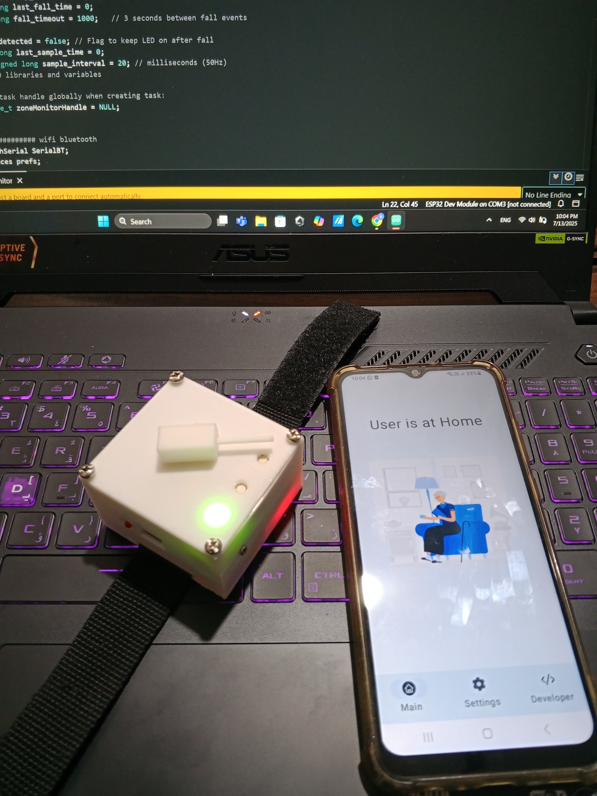
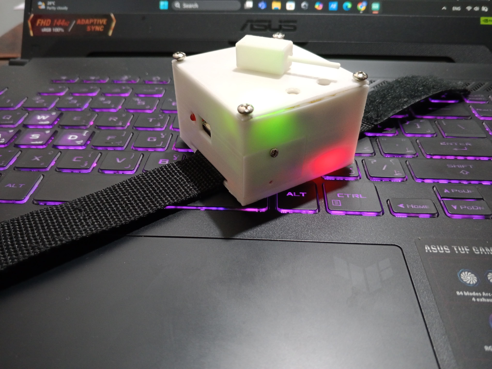

# 🧠 Wearable Safety Device for Dementia Patients

An affordable, IoT-based **smartwatch system** designed to improve the safety and well-being of **dementia patients** by providing **real-time location tracking**, **fall detection**, and **caregiver alerts** via GSM. Developed by Team InnovaTech at the University of Moratuwa.

  
  

---

## 📌 Overview

Dementia patients, especially in advanced stages, are prone to **wandering** and **accidental falls**, putting their safety at risk. This project proposes a cost-effective, comfortable, and practical **wearable solution** tailored for use in **Sri Lanka** and similar contexts. The device enables families and caregivers to monitor loved ones remotely using a mobile app and receive immediate alerts when a fall or unsafe movement is detected.

---

## 🎯 Key Features

- 📍 **GPS-Based Real-Time Tracking**
- ⚠️ **Fall Detection** using MPU6050 and ESP32
- 📡 **GSM Communication** via SIM800L (SMS & mobile data)
- 📲 **Android Mobile App** for caregivers with:
  - Live map tracking
  - Geo-fencing
  - Instant fall alerts
- 💡 **Status Indicators** for charging, connectivity, and alerts
- 🔋 **Rechargeable Battery** with safe charging module (TP4056)
- 🧰 **Custom Enclosure** and compact **PCB design**

---

## 🧩 Hardware Specifications

| Component         | Description                          |
|------------------|--------------------------------------|
| **Microcontroller** | ESP32 WROOM-32                    |
| **GPS Module**      | NEO-6M                            |
| **GSM Module**      | SIM800L                           |
| **Motion Sensor**   | MPU6050 (3-axis Accelerometer + Gyroscope) |
| **Battery**         | 3.7V 800mAh LiPo                  |
| **Charging Module** | TP4056                            |
| **Enclosure**       | 3D Printed (Custom Design)        |

---

## 📱 Mobile Application (Android)

The custom-built mobile app (developed in **Kotlin**) provides:

- Real-time location display via **Google Maps API**
- Instant **fall and geofence** alerts
- Adjustable safe zone settings
- Simple and intuitive UI for caregivers

---

## 🛠 System Architecture

The system integrates:

- **ESP32** as the central controller
- **MPU6050** for fall detection
- **GPS** for live location updates
- **SIM800L** for GSM-based communication
- **Mobile app** for monitoring and control

All components are combined into a **compact PCB** and enclosed in a **watch-style casing** designed for elderly users.

---

## 🌍 Impact and Relevance

- Developed to meet the needs of families in **Sri Lanka**, where professional dementia care is limited.
- Uses **locally available** low-cost components.
- Final device cost is ~**8000 LKR**, aiming for **<10,000 LKR retail price** after optimization.
- Addresses growing elderly population and healthcare gaps.

---

## 👨‍🔬 Team Members

**Team InnovaTech – EN1190, University of Moratuwa**

- Wedamestrige A.N. (PCB & Circuit Design)
- Ranathunga R.J.K.O.H. (Mobile App Development)
- Garusinghe S.B. (Enclosure Design)
- Prabharsha H.W.D. (Enclosure Design)

---
